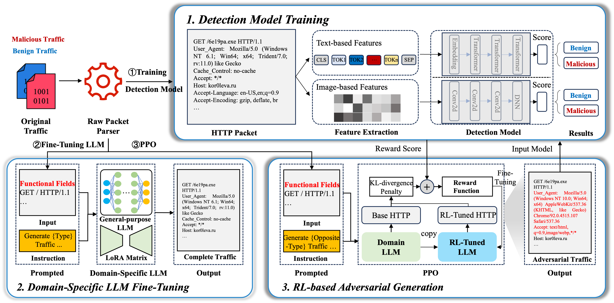

# AdvTG: An Adversarial Traffic Generation Framework to Deceive DL-Based Malicious Traffic Detection Models

This repository contains the source code and resources for **AdvTG**, an adversarial traffic generation framework designed to deceive deep learning-based malicious traffic detection systems.

## Overview



The pipeline consists of three main components:
1. **Detection Model Training**: Extracts both token-level and image-based features from HTTP traffic to train robust detection models.
2. **LLM Finetuning**: Uses instruction-style prompts to guide a large language model to generate benign or malicious traffic samples.
3. **RL-based Adversarial Generation**: Uses PPO to fine-tune the LLM in a black-box setting against a fixed DL-based traffic detector.

If you use AdvTG in your research, please cite the following paper:

```bibtex
@inproceedings{sun2025advtg,
  title={AdvTG: An Adversarial Traffic Generation Framework to Deceive DL-Based Malicious Traffic Detection Models},
  author={Sun, Peishuai and Yun, Xiaochun and Li, Shuhao and Yin, Tao and Si, Chengxiang and Xie, Jiang},
  booktitle={Proceedings of the ACM on Web Conference 2025},
  pages={3147--3159},
  year={2025}
}

If you have any questions regarding the dataset, implementation, or framework, please feel free to contact:
sunpeishuai@iie.ac.cn
